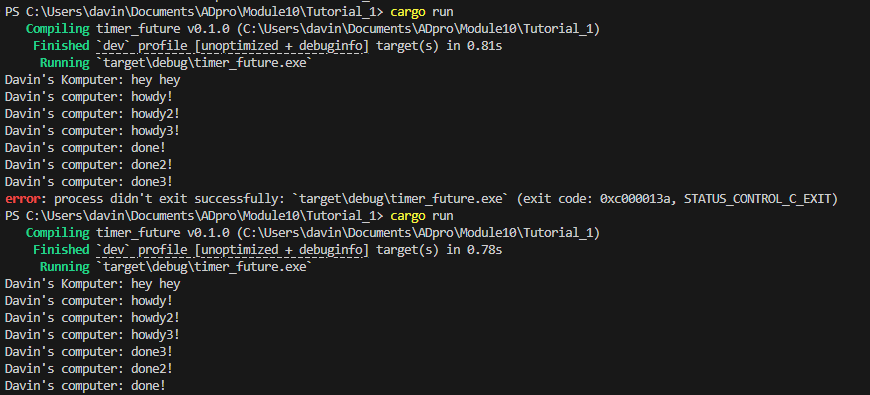

## Understanding How It Works

So for this experiment I added another print statement outside of the spawner thread but directly within the main. I did this to observe the behaviour or the order of execution. From the results its clear that the print statement that is not in the spawner ran first before the the async ones. This is because the Main thread does not care only that it ensures that the two statements are queued, that is why the "hey hey" comes first while the other two statements on a timer will only finish asynchronously which means no waiting or blocking so it will let "hey hey" go first. This shows how rust handles async behaviour where tasks are scheduled and executed separately. 

## Multiple Spawn

THe first run does not apply a drop spawner while the second one is using one. It is clear from the output that an error took place on the first one because of the lack of a drop spawner. This means that the code never indicates to the channel to close meaning that it may either end to late or to early or not at all. This causes an error and requires that the code be exited without fully running meaning some parts may not run. The second run uses the drop spawner and it runs succesfully meaning that it is important to close a channel after it is done with the tasks given if not it may wait indefinetly for tasks that will not come.