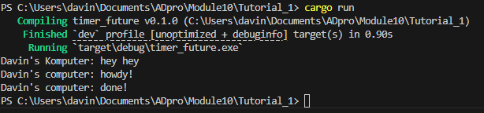

## Understanding How It Works

So for this experiment I added another print statement outside of the spawner thread but directly within the main. I did this to observe the behaviour or the order of execution. From the results its clear that the print statement that is not in the spawner ran first before the the async ones. This is because the Main thread does not care only that it ensures that the two statements are queued, that is why the "hey hey" comes first while the other two statements on a timer will only finish asynchronously which means no waiting or blocking so it will let "hey hey" go first. This shows how rust handles async behaviour where tasks are scheduled and executed separately. 